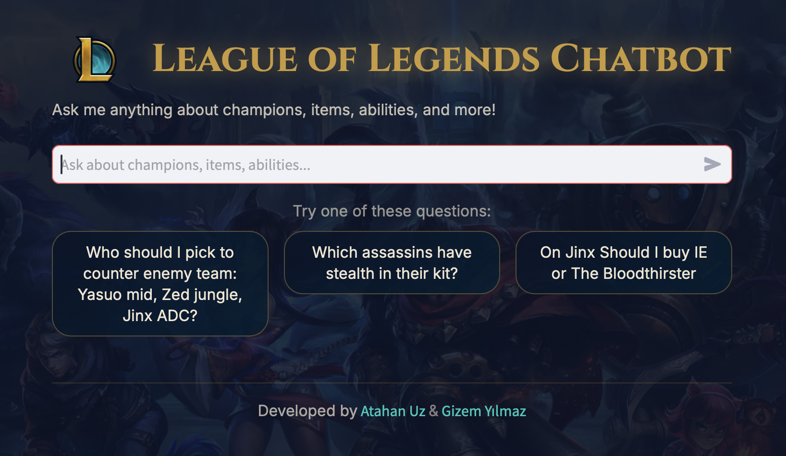

# League of Legends Chatbot

A semantic web-powered chatbot that answers questions about League of Legends using RDF/Turtle ontologies and Language Models.

Developed by [Atahan Uz](https://www.linkedin.com/in/atahan-uz/) & [Gizem Yılmaz](https://www.linkedin.com/in/gizem7/)

Presentation: Presentation.pdf

Paper: Coming Soon




## Features

- **Natural Language Queries**: Ask questions about champions, items, abilities, monsters, and turrets in plain English
- **Semantic Web Data**: Uses RDF/Turtle ontologies for structured game data representation
- **Intent Classification**: AI-powered understanding of user questions to extract relevant entities
- **Comprehensive Game Data**: Includes 171 champions, 314 items, 17 monsters, and 4 turret types
- **Multiple Interfaces**: CLI and Streamlit web interface

## Project Structure

```
ssw_chatbot/
├── src/                    # Source code
│   ├── main.py            # CLI chatbot interface
│   ├── streamlit_app.py   # Web UI interface
│   ├── config.py          # Configuration and file paths
│   ├── ttl_parser.py      # RDF/Turtle data parsing
│   ├── intent_classifier.py  # NLU intent classification
│   ├── data_retriever.py  # Data lookup and retrieval
│   ├── sparql_queries.py  # SPARQL query engine
│   ├── prompts.py         # LLM prompt templates
│   ├── snapshot_analyzer.py  # Game snapshot analysis
│   └── ontology_enricher.py  # Ontology data enrichment
├── data/
│   ├── ontology/          # RDF/Turtle ontology files
│   │   ├── lol_champions_with_counters_synergy_builds.ttl
│   │   ├── lol_items.ttl
│   │   ├── lol_monsters.ttl
│   │   ├── lol_turrets.ttl
│   │   ├── lol_enrichment.ttl
│   │   └── MobaGameOntology.rdf
│   ├── enrichment_data.json
│   └── game_snapshots.json
├── assets/                # Images and media
├── scripts/               # Utility scripts
├── docs/                  # Documentation
│   └── WORKFLOW.md
├── requirements.txt
├── .env.example
└── README.md
```

## Installation

1. **Clone the repository**
   ```bash
   git clone https://github.com/yourusername/ssw_chatbot.git
   cd ssw_chatbot
   ```

2. **Create a virtual environment**
   ```bash
   python -m venv venv
   source venv/bin/activate  # On Windows: venv\Scripts\activate
   ```

3. **Install dependencies**
   ```bash
   pip install -r requirements.txt
   ```

4. **Set up environment variables**
   ```bash
   cp .env.example .env
   # Edit .env and add your LLM API key
   ```

## Usage

### CLI Interface

Run the command-line chatbot:

```bash
cd src
python main.py
```

### Web Interface (Streamlit)

Run the Streamlit web application:

```bash
cd src
streamlit run streamlit_app.py
```

## Example Questions

- "How much damage does Evelynn's Q do at level 3?"
- "What is Ashe's base health?"
- "Who counters Aatrox?"
- "What items should I build on Aatrox?"
- "How much does Infinity Edge cost?"
- "How much health does Baron have?"
- "What is the outer turret's damage?"

## Data Sources

The chatbot uses semantic web ontologies in RDF/Turtle format:

- **Champions**: 171 champions with stats, skills, counters, synergies, and builds
- **Items**: 314 items with costs, stats, and build paths
- **Monsters**: 17 jungle monsters with health and stats
- **Turrets**: 4 turret types with health, damage, and range

## Architecture

```
User Question
      │
      ▼
┌──────────────────┐
│  Intent          │  (LLM API)
│  Classifier      │  - Extracts intent type
│                  │  - Extracts entities
└──────────────────┘
      │
      ▼
┌──────────────────┐
│  Data            │  (Local Python dictionaries)
│  Retriever       │  - Looks up structured data
│                  │  - Returns relevant information
└──────────────────┘
      │
      ▼
┌──────────────────┐
│  Response        │  (LLM API)
│  Generator       │  - Formats data into natural language
│                  │  - Maintains conversation context
└──────────────────┘
      │
      ▼
   Bot Response
```

## Requirements

- Python 3.8+
- OpenAI API Key (you can configure the app use other providers or a locally running LLM)
- Dependencies listed in `requirements.txt`


## Acknowledgments

- League of Legends game by Riot Games
- Game data by [Mobalytics](https://mobalytics.gg/lol), [LoL Wiki](https://wiki.leagueoflegends.com/en-us/), [DataDragon](https://github.com/meraki-analytics/lolstaticdata), [Leaguepedia](https://lol.fandom.com/wiki/Help:Leaguepedia_API) and [LoLAlytics](https://lolalytics.com)
- Prof. Suzan Üsküdarlı for her guidance during the project 